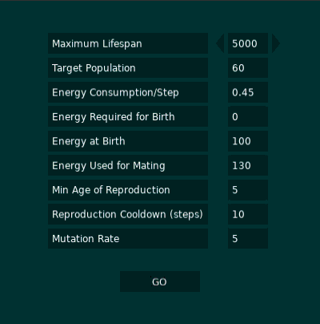

# Evolution Simulation by Yury Zhuk, Summer 2019
Created with Lua and LÖVE    
**To run: Open bin/lifesim.exe**  

This is is a small simulation of very basic life, having the ability to walk around the screen, eat, reproduce and mutate. Built just for fun and as an exercise to learn Lua.   

Every dot represents one **life**. Lifeforms consume **energy** with every step. Dark horizontal lines represent **food**. Lifeforms walking over the lines will gain energy. Every Lifeform has a "**walk sequence**," set at its birth, that controls its movement . It will follow this sequence on repeat. E.g. (left, up, up). **Mutations** occur occasionally; a mutation can affect either a **step** along the sequence, or the length of it. A mutant Lifeform will take on a new **colour**. **Reproduction** happens when two Lifeforms run into eachother, are old enough, and have enough energy. Each time they produce two **offspring** that have one parent's walk sequence and a different direction. 

Start menu is controlled by arrow keys and return/enter.
Try various start parameters to see their effects.

| Parameter | Description |
| ----------| ------------|
| Maximum Lifespan:            | The Lifeforms will not live beyond this age even if they have enough energy                | 
| Target population:           | This is an approximate control of the average population. The energy value of the food is affected by the value set here (higher target --> food gives more energy)                  | 
| Energy Consumption/Step:     | A Lifeform making one step will consume this amount of energy                              | 
| Energy Required for Birth:   | The minimum energy required for both parents to produce an offspring | 
| Energy at Birth:             | The amount of energy each Lifeform starts with| 
| Energy Used for Mating:      | The amount used by both parents to create an offspring| 
| Min Age of Reproduction:     | Mating cannot occur before both parents have taken this many steps | 
| Reproduction Cooldown(Steps):| The number of steps a Lifeform must take between producing subsequent offspring | 
| Mutation Rate:               | Number of mutations that the Lifeform will undergo in its lifetime | 

In-game controls:
  * Pause/Resume: Left/Right
  * Speed up/Slowdown: Up/Down
  * Mouseover displays information about a Lifeform.
  
